# Model
Julian During  
2 Februar 2017  


# Model Basics

## What happens if you repeat the analysis of `sim2` using a model without an intercept. What happens to the model equation? What happens to the predictions?


```r
sim2
```

```
## # A tibble: 40 × 2
##        x          y
##    <chr>      <dbl>
## 1      a  1.9353632
## 2      a  1.1764886
## 3      a  1.2436855
## 4      a  2.6235489
## 5      a  1.1120381
## 6      a  0.8660030
## 7      a -0.9100875
## 8      a  0.7207628
## 9      a  0.6865540
## 10     a  2.0673079
## # ... with 30 more rows
```

```r
ggplot(sim2, aes(x = x, y = y)) +
  geom_point()
```

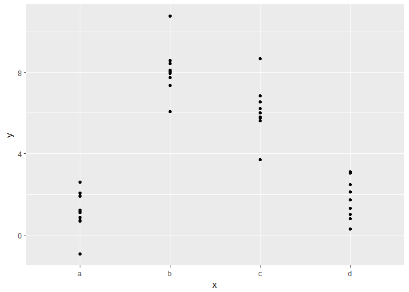<!-- -->

```r
mod2 <- lm(y ~ x - 1, data = sim2)

grid <- sim2 %>% 
  data_grid(x) %>% 
  add_predictions(mod2)
grid
```

```
## # A tibble: 4 × 2
##       x     pred
##   <chr>    <dbl>
## 1     a 1.152166
## 2     b 8.116039
## 3     c 6.127191
## 4     d 1.910981
```

```r
ggplot(sim2, aes(x)) + 
  geom_point(aes(y = y)) +
  geom_point(data = grid, aes(y = pred), colour = "red", size = 4)
```

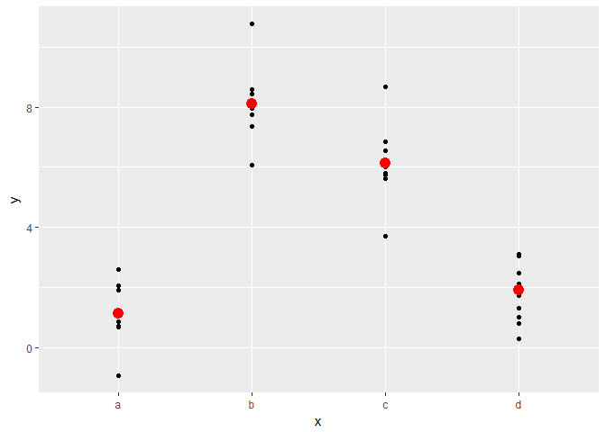<!-- -->

* Nothing different happens

## For `sim4`, which of `mod1` and `mod2` is better? I think `mod2` does a slightly better job at removing patterns, but it’s pretty subtle. Can you come up with a plot to support my claim?


```r
mod1 <- lm(y ~ x1 + x2, data = sim4)
mod2 <- lm(y ~ x1 * x2, data = sim4)
sim4_res <- sim4 %>% 
  gather_residuals(mod1, mod2)

sim4_res %>% 
  ggplot(aes(x = x1, y = resid, color = x2)) + 
    geom_point() + 
    geom_smooth() +
    facet_grid(model ~ x2)
```

```
## `geom_smooth()` using method = 'loess'
```

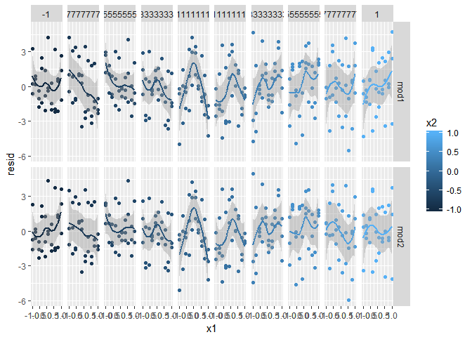<!-- -->

## Model Buildung

## In the plot of `lcarat` vs. `lprice`, there are some bright vertical strips. What do they represent?


```r
diamonds2 <- diamonds %>% 
  filter(carat <= 2.5) %>% 
  mutate(lprice = log2(price), lcarat = log2(carat))

ggplot(diamonds2, aes(x = lcarat, y = lprice)) + 
  geom_hex(bins = 50)
```

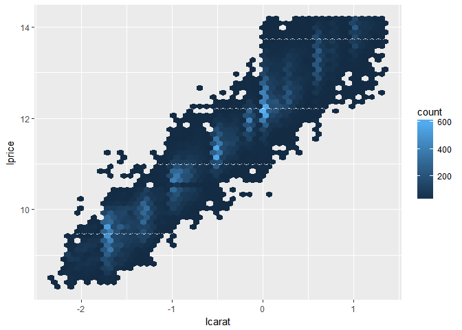<!-- -->

```r
diamonds2 %>% 
  filter(lcarat > -2, lcarat < -1.5) 
```

```
## # A tibble: 10,273 × 12
##    carat       cut color clarity depth table price     x     y     z
##    <dbl>     <ord> <ord>   <ord> <dbl> <dbl> <int> <dbl> <dbl> <dbl>
## 1   0.29   Premium     I     VS2  62.4    58   334  4.20  4.23  2.63
## 2   0.31      Good     J     SI2  63.3    58   335  4.34  4.35  2.75
## 3   0.26 Very Good     H     SI1  61.9    55   337  4.07  4.11  2.53
## 4   0.30      Good     J     SI1  64.0    55   339  4.25  4.28  2.73
## 5   0.31     Ideal     J     SI2  62.2    54   344  4.35  4.37  2.71
## 6   0.32   Premium     E      I1  60.9    58   345  4.38  4.42  2.68
## 7   0.30     Ideal     I     SI2  62.0    54   348  4.31  4.34  2.68
## 8   0.30      Good     J     SI1  63.4    54   351  4.23  4.29  2.70
## 9   0.30      Good     J     SI1  63.8    56   351  4.23  4.26  2.71
## 10  0.30 Very Good     J     SI1  62.7    59   351  4.21  4.27  2.66
## # ... with 10,263 more rows, and 2 more variables: lprice <dbl>,
## #   lcarat <dbl>
```

* Many diamonds get a carat value rounded up to the next higher unit, so that 
they can be sold for more money

## If `log(price) = a_0 + a_1 * log(carat)`, what does that say about the relationship between `price` and `carat`?

* That the price is exponentnially growing with carat.

## Extract the diamonds that have very high and very low residuals. Is there anything unusual about these diamonds? Are the particularly bad or good, or do you think these are pricing errors?


```r
mod_diamond2 <- lm(
  lprice ~ lcarat + color + cut + clarity, 
  data = diamonds2
)

diamonds2 <- diamonds2 %>% 
  add_residuals(mod_diamond2, "lresid2") 

diamonds2 %>% 
  top_n(lresid2, n = 5)
```

```
## # A tibble: 5 × 13
##   carat     cut color clarity depth table price     x     y     z
##   <dbl>   <ord> <ord>   <ord> <dbl> <dbl> <int> <dbl> <dbl> <dbl>
## 1  0.25    Fair     F     SI2  54.4    64  1013  4.30  4.23  2.32
## 2  0.25 Premium     G     SI2  59.0    60  1186  5.33  5.28  3.12
## 3  0.25 Premium     G     SI2  58.8    60  1186  5.33  5.28  3.12
## 4  0.29    Fair     F     SI1  55.8    60  1776  4.48  4.41  2.48
## 5  0.34    Fair     F      I1  55.8    62  2160  4.72  4.60  2.60
## # ... with 3 more variables: lprice <dbl>, lcarat <dbl>, lresid2 <dbl>
```

```r
diamonds2 %>% 
  top_n(lresid2, n = -5)
```

```
## # A tibble: 5 × 13
##   carat     cut color clarity depth table price     x     y     z   lprice
##   <dbl>   <ord> <ord>   <ord> <dbl> <dbl> <int> <dbl> <dbl> <dbl>    <dbl>
## 1  1.27 Premium     H     SI2  59.3    61  2845  7.12  7.05  4.20 11.47421
## 2  1.52    Good     E      I1  57.3    58  3105  7.53  7.42  4.28 11.60038
## 3  1.52    Good     E      I1  57.3    58  3105  7.53  7.42  4.28 11.60038
## 4  2.46 Premium     E     SI2  59.7    59 10470  8.82  8.76  5.25 13.35397
## 5  1.03    Fair     E      I1  78.2    54  1262  5.72  5.59  4.42 10.30150
## # ... with 2 more variables: lcarat <dbl>, lresid2 <dbl>
```

```r
ggplot(diamonds2, aes(x = lcarat, y = lprice)) + 
  geom_hex(bins = 50) + 
  geom_point(data = diamonds2 %>% top_n(lresid2, n = 10), color = "green") + 
  geom_point(data = diamonds2 %>% top_n(lresid2, n = -10), color = "red")
```

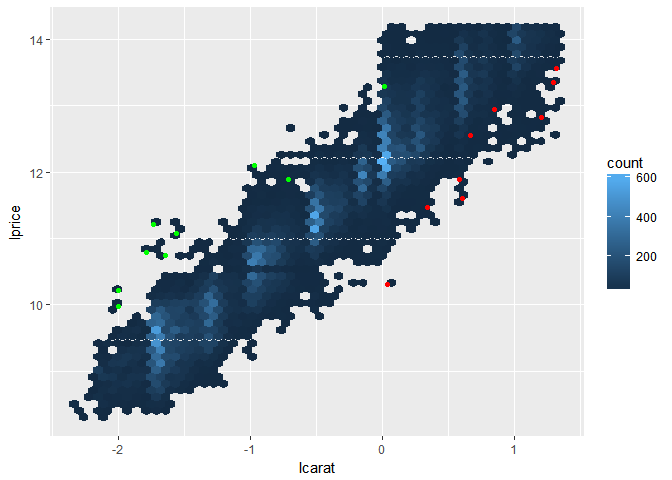<!-- -->

```r
ggplot(diamonds2, aes(lcarat, lresid2)) +
  geom_point()
```

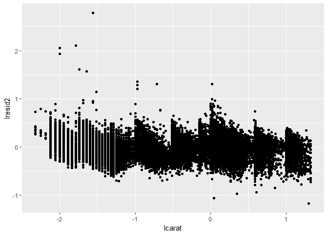<!-- -->


* The diamonds, that we have understimated, seem to have a very similar carat 
number
* The overestimated diamonds don't have a similar carat number

## Does the final model, `mod_diamonds2`, do a good job of predicting diamond prices? Would you trust it to tell you how much to spend if you were buying a diamond?

* There is still some pattern in the residuals left. Maybe include shape information (brillants??)?
Formula: Gewicht in Karat = Durchmesser^3 * 0.0037

## Use your Google sleuthing skills to brainstorm why there were fewer than expected flights on Jan 20, May 26, and Sep 1. (Hint: they all have the same explanation.) How would these days generalise to another year?

* Days before a public holiday that fall on a Sunday. This doesn't generalise well 
to another year.

## Create a new variable that splits the `wday` variable into terms, but only for Saturdays, i.e. it should have `Thurs`, `Fri`, but `Sat-summer`, `Sat-spring`, `Sat-fall`. How does this model compare with the model with every combination of wday and term?


```r
term <- function(date) {
  cut(date, 
    breaks = ymd(20130101, 20130605, 20130825, 20140101),
    labels = c("spring", "summer", "fall") 
  )
}

#Helper function for later use
public_holiday <- function(date) {
  nyc_public_holidays <- c(
    "20130101", "20130121", "20130218", "20130527", 
    "20130704", "20130902", "20131014", "20131111", "20131128", "20131225")
  nyc_public_holidays <- ymd(nyc_public_holidays)
  return(date %in% nyc_public_holidays)
}

daily <- flights %>% 
  mutate(
    date = make_date(year, month, day)) %>% 
  group_by(date) %>% 
  summarise(n = n(), mean_dist = sum(distance) / n) 

daily
```

```
## # A tibble: 365 × 3
##          date     n mean_dist
##        <date> <int>     <dbl>
## 1  2013-01-01   842 1077.4299
## 2  2013-01-02   943 1053.1177
## 3  2013-01-03   914 1037.3709
## 4  2013-01-04   915 1032.4754
## 5  2013-01-05   720 1067.5917
## 6  2013-01-06   832 1051.6466
## 7  2013-01-07   933  998.2572
## 8  2013-01-08   899  985.5328
## 9  2013-01-09   902  981.4202
## 10 2013-01-10   932  993.1856
## # ... with 355 more rows
```

Model from the book: 


```r
mod3 <- MASS::rlm(n ~ wday(date, label = TRUE) * term(date), data = daily)

daily %>% 
  add_residuals(mod3, "resid") %>% 
  ggplot(aes(date, resid)) + 
  geom_hline(yintercept = 0, size = 2, colour = "white") + 
  geom_line()
```

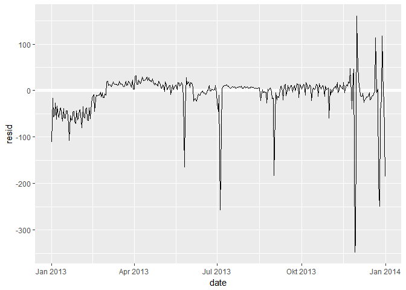<!-- -->

Own model:


```r
wday2 <- function(x) wday(x, label = TRUE)

make_vars <- function(data) {
  data %>% 
    mutate(
      term = term(date),
      wday = wday2(date), 
      holiday = public_holiday(date), 
      wday_term = if_else(wday == "Sat", paste0(wday, "_", term), as.character(wday)), 
      wday_term_holiday = if_else(holiday, paste0(wday_term, "_", "hol"), wday_term), 
      month = month(date)
    )
}

mod4 <- MASS::rlm(n ~ wday_term, data = make_vars(daily))
```


```r
make_vars(daily) %>% 
  gather_residuals(mod_book = mod3, sat_term_model = mod4) %>% 
  ggplot(aes(date, resid, color = model)) +
    geom_line(alpha = 0.75)
```

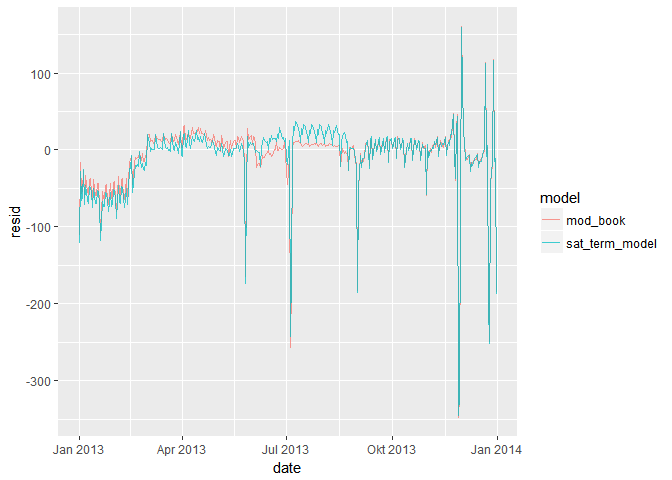<!-- -->

The new model doesn't seem to fit the data as well, as the model from the book.
Especially during summer holidays.

##Create a new wday variable that combines the day of week, term (for Saturdays), and public holidays. What do the residuals of that model look like?


```r
mod5 <- MASS::rlm(n ~ wday_term_holiday, data = make_vars(daily))

make_vars(daily) %>% 
  gather_residuals(sat_term_model = mod4, sat_term_hol_model = mod5) %>% 
  ggplot(aes(date, resid, color = model)) +
    geom_line(alpha = 0.75)
```

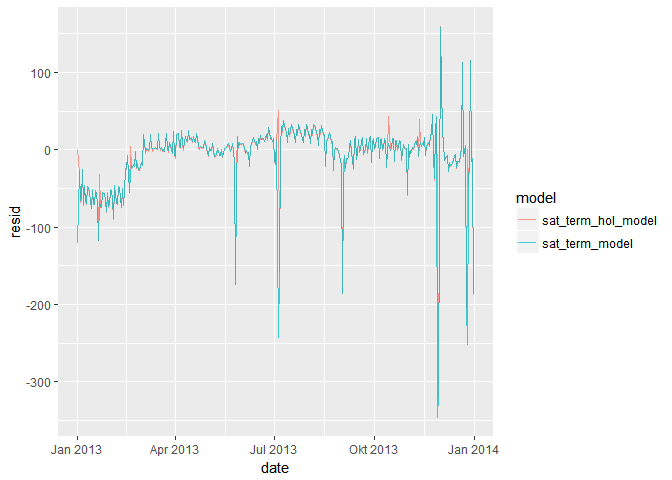<!-- -->

The outliers don't seem to be that drastic. In April there might be a false 
public holiday.


## What happens if you fit a day of week effect that varies by month (i.e. `n ~ wday * month`)? Why is this not very helpful?


```r
mod6 <- MASS::rlm(n ~ wday * month, data = make_vars(daily))

make_vars(daily) %>% 
  gather_residuals(mod_book = mod3, monthly_wday_mod = mod6) %>% 
  ggplot(aes(date, resid, color = model)) +
    geom_line(alpha = 0.75)
```

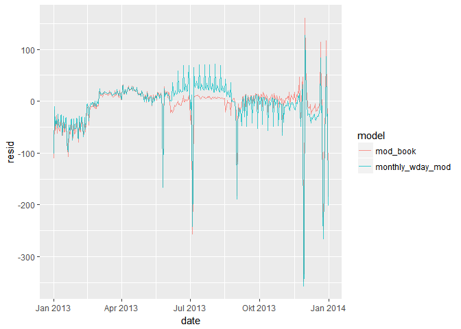<!-- -->

It's not very useful, because it ignores the fact, that some months are different 
from other (for example summer months).

## What would you expect the model `n ~ wday + ns(date, 5)` to look like? Knowing what you know about the data, why would you expect it to be not particularly effective?


```r
mod <- MASS::rlm(n ~ wday + ns(date, 5), data = make_vars(daily))

make_vars(daily) %>% 
  gather_residuals(mod_book = mod3, ns_mod = mod) %>% 
  ggplot(aes(date, resid, color = model)) +
    geom_line(alpha = 0.75)
```

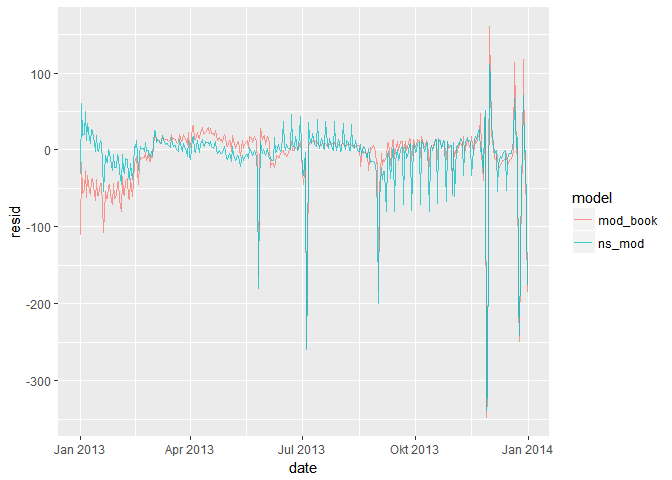<!-- -->

It ignores the relationsship between Saturdays and term and therefore misses some
of the pattern in the data.

## We hypothesised that people leaving on Sundays are more likely to be business travellers who need to be somewhere on Monday. Explore that hypothesis by seeing how it breaks down based on distance and time: if it’s true, you’d expect to see more Sunday evening flights to places that are far away.


```r
ggplot(make_vars(daily), aes(x = wday, y = mean_dist)) + 
  geom_boxplot() 
```

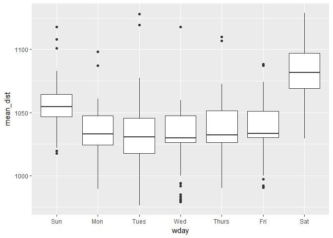<!-- -->

## It’s a little frustrating that Sunday and Saturday are on separate ends of the plot. Write a small function to set the levels of the factor so that the week starts on Monday.


```r
reorder_wday <- function(wday) {
  factor(wday, levels = c("Mon", "Tues", "Wed", "Thurs", "Fri", "Sat", "Sun"))
}

help_df <- make_vars(daily) %>% 
  mutate(wday = reorder_wday(wday))

ggplot(help_df, aes(x = wday, y = mean_dist)) + 
  geom_boxplot() 
```

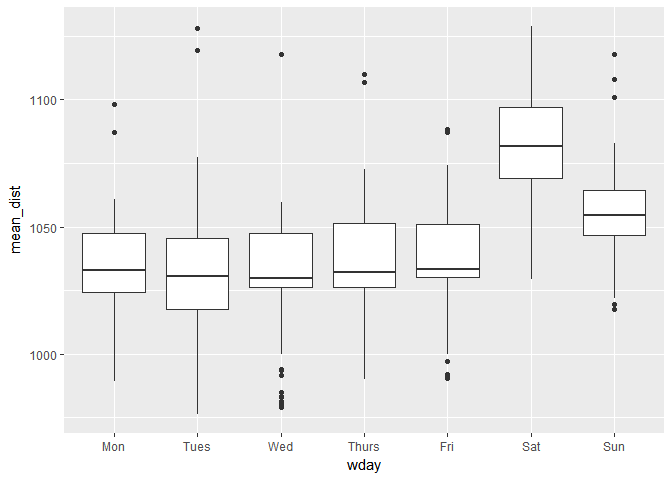<!-- -->

