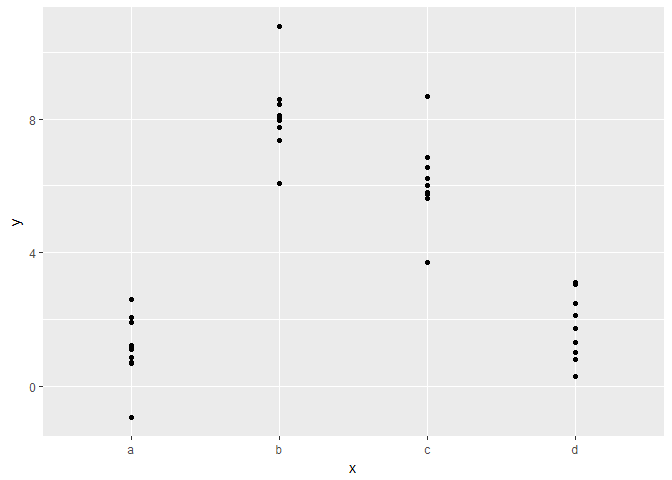
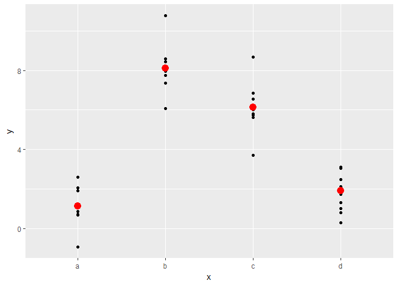
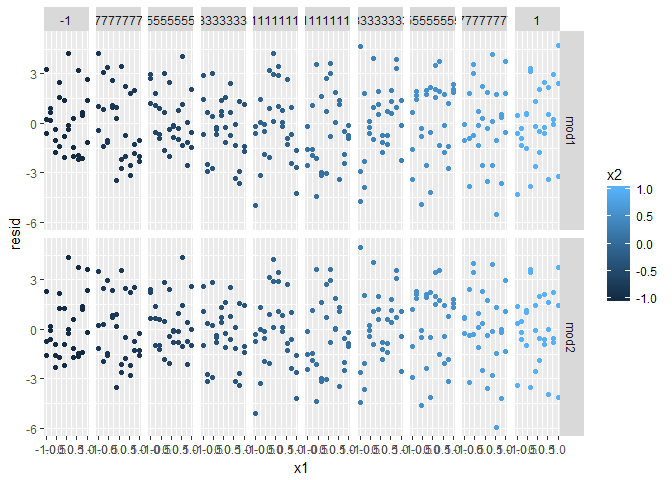
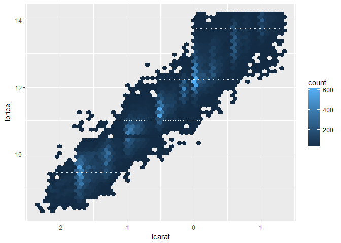
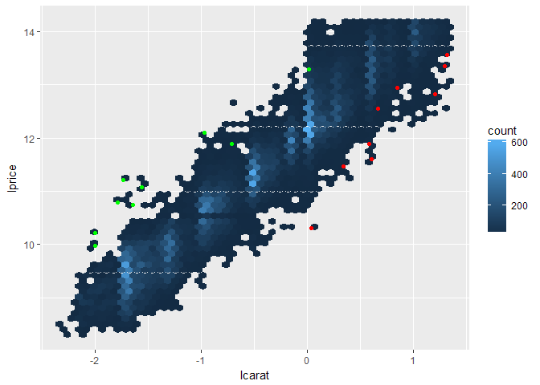
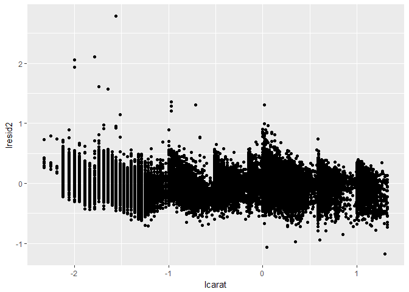

Exercises
================
Julian During
15 Januar 2017

Program
=======

Vectors
-------

### Describe the difference between `is.finite(x)` and `!is.infinite(x)`

``` r
tibble(
  input = c(4, Inf, -Inf, NA, NaN),
  is_finite = is.finite(input), 
  not_is_infinite = !is.infinite(input)
)
```

    ## # A tibble: 5 × 3
    ##   input is_finite not_is_infinite
    ##   <dbl>     <lgl>           <lgl>
    ## 1     4      TRUE            TRUE
    ## 2   Inf     FALSE           FALSE
    ## 3  -Inf     FALSE           FALSE
    ## 4    NA     FALSE            TRUE
    ## 5   NaN     FALSE            TRUE

### Read the source code for `dplyr::near()`. How does it work?

``` r
dplyr::near
```

    ## function (x, y, tol = .Machine$double.eps^0.5) 
    ## {
    ##     abs(x - y) < tol
    ## }
    ## <environment: namespace:dplyr>

Look at the absolute deviation of two numbers and compare if it is smaller than the square root of the machines precision of doubles.

### How many values can an integer vector take? How many can a double vector take?

Integer: +/- 2\*10^9 Double: +/- 1.797693e+308

### Brainstorm at least 4 functions, that allow you to convert a double to an integer?

-   `as.integer`
-   `L`

### What functions from the readr package allow you to turn a string into logical, integer, and double vector?

`parse_logical`, `parse_integer`, `parse_double`

### What does `mean(is.na(x))` tell you about a vector x? What about `sum(!is.finite(x))`?

-   The percentage of NA values
-   Number of infinite elemts

### Carefully read the documentation of `is.vector()`. What does it actually test for? Why does `is.atomic()` not agree with the definition of atomic vectors above?

-   Test if a vector has no attributes (other than name)?
-   An object can be atomic but not a vector

### Compare and contrast `setNames()` with `purrr::set_names()`.

``` r
setNames
```

    ## function (object = nm, nm) 
    ## {
    ##     names(object) <- nm
    ##     object
    ## }
    ## <bytecode: 0x0000000011fcc608>
    ## <environment: namespace:stats>

``` r
purrr::set_names
```

    ## function (x, nm = x) 
    ## {
    ##     if (!is_vector(x)) {
    ##         stop("`x` must be a vector", call. = FALSE)
    ##     }
    ##     if (length(x) != length(nm)) {
    ##         stop("`x` and `nm` must be the same length", call. = FALSE)
    ##     }
    ##     names(x) <- nm
    ##     x
    ## }
    ## <environment: namespace:purrr>

`purrr::set_names` checks if object is vector and also compares lengths -&gt; no refactoring

### Create functions that take a vector as input and returns:

-   The last value. Should you use \[ or \[\[?

``` r
last_value <- function(x) {
  x[length(x)]
}
last_value(c(a = 1, b = 2, c = 3))
```

    ## c 
    ## 3

-   The elements at even numbered positions.

``` r
even_pos <- function(x) {
  x[1:length(x) %% 2 == 0]
}
even_pos(c(1,3,3,4,5,6,8))
```

    ## [1] 3 4 6

\*Every element except the last value.

``` r
not_last_value <- function(x) {
  x[-length(x)]
}
not_last_value(c(1,2,3,4,5))
```

    ## [1] 1 2 3 4

\*Only even numbers (and no missing values).

``` r
even_numbers <- function(x) {
  x[(x %% 2 == 0) & (!is.na(x))]
}
even_numbers(c(1,2,3,4,5,6,NA,NA))
```

    ## [1] 2 4 6

### Why is `x[-which(x > 0)]` not the same as `x[x <= 0]`?

Indexing by number / boolean.

### What happens when you subset with a positive integer that’s bigger than the length of the vector? What happens when you subset with a name that doesn’t exist?

``` r
x <- c(a = 1, b = 2, c = 3)
x[4]
```

    ## <NA> 
    ##   NA

``` r
x["d"]
```

    ## <NA> 
    ##   NA

### Draw the following lists as nested sets:

-   `list(a, b, list(c, d), list(e, f))`


-   `list(list(list(list(list(list(a))))))` 

### What happens if you subset a tibble as if you’re subsetting a list? What are the key differences between a list and a tibble?

If you subset a tibble, you always get a tibble back.

### What does hms::hms(3600) return? How does it print? What primitive type is the augmented vector built on top of? What attributes does it use?

``` r
hour <- hms::hms(3600)
hour
```

    ## 01:00:00

``` r
typeof(hour)
```

    ## [1] "double"

``` r
attributes(hour)
```

    ## $units
    ## [1] "secs"
    ## 
    ## $class
    ## [1] "hms"      "difftime"

### Try and make a tibble that has columns with different lengths. What happens?

-   Error

### Based on the definition above, is it ok to have a list as a column of a tibble?

``` r
tibble::tibble(
  a = c(1, 2, 3),
  b = list(c(3, 4, 5), 2, 3)
)
```

    ## # A tibble: 3 × 2
    ##       a         b
    ##   <dbl>    <list>
    ## 1     1 <dbl [3]>
    ## 2     2 <dbl [1]>
    ## 3     3 <dbl [1]>

Model
=====

Model Basics
------------

### What happens if you repeat the analysis of `sim2` using a model without an intercept. What happens to the model equation? What happens to the predictions?

``` r
sim2
```

    ## # A tibble: 40 × 2
    ##        x          y
    ##    <chr>      <dbl>
    ## 1      a  1.9353632
    ## 2      a  1.1764886
    ## 3      a  1.2436855
    ## 4      a  2.6235489
    ## 5      a  1.1120381
    ## 6      a  0.8660030
    ## 7      a -0.9100875
    ## 8      a  0.7207628
    ## 9      a  0.6865540
    ## 10     a  2.0673079
    ## # ... with 30 more rows

``` r
ggplot(sim2, aes(x = x, y = y)) +
  geom_point()
```



``` r
mod2 <- lm(y ~ x - 1, data = sim2)

grid <- sim2 %>% 
  data_grid(x) %>% 
  add_predictions(mod2)
grid
```

    ## # A tibble: 4 × 2
    ##       x     pred
    ##   <chr>    <dbl>
    ## 1     a 1.152166
    ## 2     b 8.116039
    ## 3     c 6.127191
    ## 4     d 1.910981

``` r
ggplot(sim2, aes(x)) + 
  geom_point(aes(y = y)) +
  geom_point(data = grid, aes(y = pred), colour = "red", size = 4)
```



-   Nothing different happens

### For `sim4`, which of `mod1` and `mod2` is better? I think mod2 does a slightly better job at removing patterns, but it’s pretty subtle. Can you come up with a plot to support my claim?

``` r
mod1 <- lm(y ~ x1 + x2, data = sim4)
mod2 <- lm(y ~ x1 * x2, data = sim4)
sim4_res <- sim4 %>% 
  gather_residuals(mod1, mod2)

sim4_res %>% 
  ggplot(aes(x = x1, y = resid, color = x2)) + 
    geom_point() +
    facet_grid(model ~ x2)
```



Model Buildung
--------------

### In the plot of `lcarat` vs. `lprice`, there are some bright vertical strips. What do they represent?

``` r
diamonds2 <- diamonds %>% 
  filter(carat <= 2.5) %>% 
  mutate(lprice = log2(price), lcarat = log2(carat))

ggplot(diamonds2, aes(x = lcarat, y = lprice)) + 
  geom_hex(bins = 50)
```



``` r
diamonds2 %>% 
  filter(lcarat > -2, lcarat < -1.5) 
```

    ## # A tibble: 10,273 × 12
    ##    carat       cut color clarity depth table price     x     y     z
    ##    <dbl>     <ord> <ord>   <ord> <dbl> <dbl> <int> <dbl> <dbl> <dbl>
    ## 1   0.29   Premium     I     VS2  62.4    58   334  4.20  4.23  2.63
    ## 2   0.31      Good     J     SI2  63.3    58   335  4.34  4.35  2.75
    ## 3   0.26 Very Good     H     SI1  61.9    55   337  4.07  4.11  2.53
    ## 4   0.30      Good     J     SI1  64.0    55   339  4.25  4.28  2.73
    ## 5   0.31     Ideal     J     SI2  62.2    54   344  4.35  4.37  2.71
    ## 6   0.32   Premium     E      I1  60.9    58   345  4.38  4.42  2.68
    ## 7   0.30     Ideal     I     SI2  62.0    54   348  4.31  4.34  2.68
    ## 8   0.30      Good     J     SI1  63.4    54   351  4.23  4.29  2.70
    ## 9   0.30      Good     J     SI1  63.8    56   351  4.23  4.26  2.71
    ## 10  0.30 Very Good     J     SI1  62.7    59   351  4.21  4.27  2.66
    ## # ... with 10,263 more rows, and 2 more variables: lprice <dbl>,
    ## #   lcarat <dbl>

-   Many diamonds get a carat value rounded up to the next higher unit, so that they can be sold for more money

### If `log(price) = a_0 + a_1 * log(carat), what does that say about the relationship between`price`and`carat\`?

-   That the price is exponentnially growing with carat.

### Extract the diamonds that have very high and very low residuals. Is there anything unusual about these diamonds? Are the particularly bad or good, or do you think these are pricing errors?

``` r
mod_diamond2 <- lm(
  lprice ~ lcarat + color + cut + clarity, 
  data = diamonds2
)

diamonds2 <- diamonds2 %>% 
  add_residuals(mod_diamond2, "lresid2") 

diamonds2 %>% 
  top_n(lresid2, n = 5)
```

    ## # A tibble: 5 × 13
    ##   carat     cut color clarity depth table price     x     y     z
    ##   <dbl>   <ord> <ord>   <ord> <dbl> <dbl> <int> <dbl> <dbl> <dbl>
    ## 1  0.25    Fair     F     SI2  54.4    64  1013  4.30  4.23  2.32
    ## 2  0.25 Premium     G     SI2  59.0    60  1186  5.33  5.28  3.12
    ## 3  0.25 Premium     G     SI2  58.8    60  1186  5.33  5.28  3.12
    ## 4  0.29    Fair     F     SI1  55.8    60  1776  4.48  4.41  2.48
    ## 5  0.34    Fair     F      I1  55.8    62  2160  4.72  4.60  2.60
    ## # ... with 3 more variables: lprice <dbl>, lcarat <dbl>, lresid2 <dbl>

``` r
diamonds2 %>% 
  top_n(lresid2, n = -5)
```

    ## # A tibble: 5 × 13
    ##   carat     cut color clarity depth table price     x     y     z   lprice
    ##   <dbl>   <ord> <ord>   <ord> <dbl> <dbl> <int> <dbl> <dbl> <dbl>    <dbl>
    ## 1  1.27 Premium     H     SI2  59.3    61  2845  7.12  7.05  4.20 11.47421
    ## 2  1.52    Good     E      I1  57.3    58  3105  7.53  7.42  4.28 11.60038
    ## 3  1.52    Good     E      I1  57.3    58  3105  7.53  7.42  4.28 11.60038
    ## 4  2.46 Premium     E     SI2  59.7    59 10470  8.82  8.76  5.25 13.35397
    ## 5  1.03    Fair     E      I1  78.2    54  1262  5.72  5.59  4.42 10.30150
    ## # ... with 2 more variables: lcarat <dbl>, lresid2 <dbl>

``` r
ggplot(diamonds2, aes(x = lcarat, y = lprice)) + 
  geom_hex(bins = 50) + 
  geom_point(data = diamonds2 %>% top_n(lresid2, n = 10), color = "green") + 
  geom_point(data = diamonds2 %>% top_n(lresid2, n = -10), color = "red")
```



``` r
ggplot(diamonds2, aes(lcarat, lresid2)) +
  geom_point()
```



-   The diamonds, that we have understimated, seem to have a very similar carat number
-   The overestimated diamonds don't have a similar carat number

### Does the final model, `mod_diamonds2`, do a good job of predicting diamond prices? Would you trust it to tell you how much to spend if you were buying a diamond?

-   There is still some pattern in the residuals left. Maybe include shape information (brillants??)? Formula: Gewicht in Karat = Durchmesser^3 \* 0.0037
