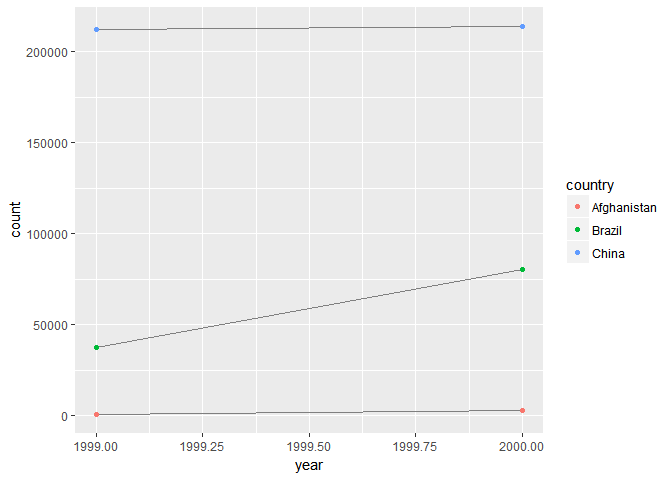

# Wrangle
Julian During  
24 Februar 2017  


```r
library(tidyverse)
library(stringr)
```


# Tidy Data

## Using prose, describe how the variables and observations are organised in each of the sample tables.

* `table1`
Every observations is a row and every variable is a column.

* `table2`
The variable `type` determines which variable we are currently looking at.

* `table3`
`rate` is the only variable in this one. It is already calculated, so it's hard 
to figure out the meaning.

* `table4a`
The years are presented as columns in this one. The numbers represent the cases

* `table4b`
The years are presented as columns in this one. The numbers represent the cases

## Compute the rate for table2, and table4a + table4b. Which representation is easiest to work with? Which is hardest? Why?

How it should look like


```r
table1 %>% 
  mutate(rate = cases / population * 10000)
```

```
## # A tibble: 6 × 5
##       country  year  cases population     rate
##         <chr> <int>  <int>      <int>    <dbl>
## 1 Afghanistan  1999    745   19987071 0.372741
## 2 Afghanistan  2000   2666   20595360 1.294466
## 3      Brazil  1999  37737  172006362 2.193930
## 4      Brazil  2000  80488  174504898 4.612363
## 5       China  1999 212258 1272915272 1.667495
## 6       China  2000 213766 1280428583 1.669488
```

For table2


```r
table2 %>% 
  group_by(country, year) %>% 
  summarise(rate = count[type == "cases"] / count[type == "population"] * 10000)
```

```
## Source: local data frame [6 x 3]
## Groups: country [?]
## 
##       country  year     rate
##         <chr> <int>    <dbl>
## 1 Afghanistan  1999 0.372741
## 2 Afghanistan  2000 1.294466
## 3      Brazil  1999 2.193930
## 4      Brazil  2000 4.612363
## 5       China  1999 1.667495
## 6       China  2000 1.669488
```

For table 3: 


```r
table3 %>% 
  mutate(
    strings = str_split(rate, "/"), 
    cases = map_int(strings, ~ as.integer(.[1])), 
    population = map_int(strings, ~ as.integer(.[2]))) %>% 
  group_by(country, year) %>% 
  summarise(rate = cases / population * 10000)
```

```
## Source: local data frame [6 x 3]
## Groups: country [?]
## 
##       country  year     rate
##         <chr> <int>    <dbl>
## 1 Afghanistan  1999 0.372741
## 2 Afghanistan  2000 1.294466
## 3      Brazil  1999 2.193930
## 4      Brazil  2000 4.612363
## 5       China  1999 1.667495
## 6       China  2000 1.669488
```

For table 4a + 4b: 


```r
table4a_tidy <- table4a %>% 
  gather(key = year, value = cases, -country)

table4b_tidy <- table4b %>% 
  gather(key = year, value = population, -country)

table4a_tidy %>% 
  left_join(table4b_tidy) %>% 
  group_by(country, year) %>% 
  summarise(rate = cases / population * 10000)
```

```
## Joining, by = c("country", "year")
```

```
## Source: local data frame [6 x 3]
## Groups: country [?]
## 
##       country  year     rate
##         <chr> <chr>    <dbl>
## 1 Afghanistan  1999 0.372741
## 2 Afghanistan  2000 1.294466
## 3      Brazil  1999 2.193930
## 4      Brazil  2000 4.612363
## 5       China  1999 1.667495
## 6       China  2000 1.669488
```

## Recreate the plot showing change in cases over time using table2 instead of table1. What do you need to do first?


```r
table2 %>% 
  filter(type == "cases") %>% 
  ggplot(aes(year, count)) + 
    geom_line(aes(group = country), colour = "grey50") + 
    geom_point(aes(colour = country))
```

<!-- -->

First you have to include a filter, to show only `type == "cases"`

## Why are `gather()` and `spread()` not perfectly symmetrical? Carefully consider the following example: (Hint: look at the variable types and think about column names.) Both `spread()` and `gather()` have a convert argument. What does it do?


```r
stocks <- tibble(
  year   = c(2015, 2015, 2016, 2016),
  half  = c(   1,    2,     1,    2),
  return = c(1.88, 0.59, 0.92, 0.17)
)
stocks %>% 
  spread(key = year, value = return) %>% 
  gather(key = "year", value = "return", `2015`:`2016`)
```

```
## # A tibble: 4 × 3
##    half  year return
##   <dbl> <chr>  <dbl>
## 1     1  2015   1.88
## 2     2  2015   0.59
## 3     1  2016   0.92
## 4     2  2016   0.17
```

In the `spread` step, the year variable becomes the new column names. 
Therefore they get turned from integer into characters. 
If you want to prevent this behavior, you could use the `convert` parameter.

## Why does this code fail?


```r
#table4a %>% 
#  gather(1999, 2000, key = "year", value = "cases")
```

Because the years are not quoted. It is mandatory to do this, because these are
nonsyntactic names.

## Why does spreading this tibble fail? How could you add a new column to fix the problem?


```r
people <- tribble(
  ~name,             ~key,    ~value,
  #-----------------|--------|------
  "Phillip Woods",   "age",       45,
  "Phillip Woods",   "height",   186,
  "Phillip Woods",   "age",       50,
  "Jessica Cordero", "age",       37,
  "Jessica Cordero", "height",   156
)

people %>% 
  mutate(id = c(1, 1, 2, 3, 3)) %>% 
  spread(key = key, value = value)
```

```
## # A tibble: 3 × 4
##              name    id   age height
## *           <chr> <dbl> <dbl>  <dbl>
## 1 Jessica Cordero     3    37    156
## 2   Phillip Woods     1    45    186
## 3   Phillip Woods     2    50     NA
```

Because you have duplicate indentifiers ("Phillip Woods" and "age"). 
By introducing a unique `id` column, one could fix this problem.

## Tidy the simple tibble below. Do you need to spread or gather it? What are the variables?


```r
preg <- tribble(
  ~pregnant, ~male, ~female,
  "yes",     NA,    10,
  "no",      20,    12
)

preg %>% 
  gather(key = "sex", value = "number", -pregnant)
```

```
## # A tibble: 4 × 3
##   pregnant    sex number
##      <chr>  <chr>  <dbl>
## 1      yes   male     NA
## 2       no   male     20
## 3      yes female     10
## 4       no female     12
```

You need to gather it. The variables are pregnant, sex and number.

## What do the `extra` and `fill` arguments do in `separate()`? Experiment with the various options for the following two toy datasets.


```r
test1 <- tibble(x = c("a,b,c", "d,e,f,g", "h,i,j"))

test1 %>% 
  separate(x, c("one", "two", "three"), extra = "drop")
```

```
## # A tibble: 3 × 3
##     one   two three
## * <chr> <chr> <chr>
## 1     a     b     c
## 2     d     e     f
## 3     h     i     j
```

```r
test1 %>% 
  separate(x, c("one", "two", "three"), extra = "merge")
```

```
## # A tibble: 3 × 3
##     one   two three
## * <chr> <chr> <chr>
## 1     a     b     c
## 2     d     e   f,g
## 3     h     i     j
```

```r
test2 <- tibble(x = c("a,b,c", "d,e", "f,g,i"))

test2 %>% 
  separate(x, c("one", "two", "three"), fill = "right")
```

```
## # A tibble: 3 × 3
##     one   two three
## * <chr> <chr> <chr>
## 1     a     b     c
## 2     d     e  <NA>
## 3     f     g     i
```

```r
test2 %>% 
  separate(x, c("one", "two", "three"), fill = "left")
```

```
## # A tibble: 3 × 3
##     one   two three
## * <chr> <chr> <chr>
## 1     a     b     c
## 2  <NA>     d     e
## 3     f     g     i
```

## Both `unite()` and `separate()` have a `remove` argument. What does it do? Why would you set it to `FALSE`?

It determines, if the original column should be kept or removed. If you set it
to `FALSE`, the original column is kept.

## Compare and contrast `separate()` and `extract()`. Why are there three variations of separation (by position, by separator, and with groups), but only one unite?

Extract looks at existing groups (based on a regex) in the data. If not present
return `NA`.

## Compare and contrast the `fill` arguments to `spread()` and `complete()`.

The fill argument in `spread` will replace explicit missing values. `complete`
won't do that.

## What does the direction argument to fill() do

It determines if the missing values should be filled from "down" or "up".

## In this case study I set `na.rm = TRUE` just to make it easier to check that we had the correct values. Is this reasonable? Think about how missing values are represented in this dataset. Are there implicit missing values? What’s the difference between an `NA` and `zero`?

You should first check, that `NA` values are not explicit missing values. 
In this dataset, the explicit missing values are represented by 0.

# Strings

## In code that doesn't use stringr, you'll often see `paste()` and `paste0()`. What's the difference between the two functions? What stringr function are they equivalent to? How do the functions differ in their handling of `NA`?

* `paste0` automatically takes an empty string as `sep` argument
* str_c


```r
paste0("a", "b", NA, "d")
```

```
## [1] "abNAd"
```

```r
str_c("a", "b", NA, "d")
```

```
## [1] NA
```

* `str_c` converts to `NA`, if one string is `NA`

##In your own words, describe the difference between the `sep` and `collapse` arguments to `str_c()`.


```r
str_c(c("a", "b"), c("c", "d"), "hello", sep = ",") 
```

```
## [1] "a,c,hello" "b,d,hello"
```

```r
str_c(c("a", "b"), c("c", "d"), "hello", collapse = ",")
```

```
## [1] "achello,bdhello"
```

The `collapse` argument, collapses the different strings into one big string. 
`sep` doesn't.

## Use `str_length()` and `str_sub()` to extract the middle character from a string. What will you do if the string has an even number of characters?


```r
test1 <- "hallo"
test2 <- "test"

middle_character <- function(string) {
  middle <- (str_length(string) + 1) / 2
  str_sub(string, start = middle, end = middle)
}

middle_character("hallo")
```

```
## [1] "l"
```

```r
middle_character("test")
```

```
## [1] "e"
```

You have to decide, if you choose the left or right character from the middle.
You could do this by including an additional parameter in the above function.

## What does `str_wrap()` do? When might you want to use it?

It determines when to put text in a new line. You might use it, when you want a 
nicely formated text and only have a fixed width of space available.

## What does `str_trim()` do? What's the opposite of `str_trim()`?

It trims leading and trailing whitespaces from a string. 
The opposite is `str_pad`.

## Write a function that turns (e.g.) a vector `c("a", "b", "c")` into the string `a, b, and c`.Think carefully about what it should do if given a vector of length 0, 1, or 2.


```r
str_add_and <- function(string_vector) {
  if (length(string_vector) <= 1)
    return(string_vector)
  if (length(string_vector) == 2)
    return(str_c(string_vector, collapse = ", "))
  last_string <- string_vector[length(string_vector)]
  front_string <- string_vector[-length(string_vector)]
  str_c(str_c(front_string, collapse = ", "), last_string, sep = " and ")
}
str_add_and(c("a", "b", "c", "d"))
```

```
## [1] "a, b, c and d"
```

```r
str_add_and(c("a"))
```

```
## [1] "a"
```

```r
str_add_and(c("a", "b"))
```

```
## [1] "a, b"
```

```r
str_add_and(c())
```

```
## NULL
```

## Explain why each of these strings don't match a `\`: `"\"`, `"\\"`, `"\\\"`.

* It only uses the special ability of the backslash
* To create a regex, you need a string
* In the string, you also need to escape the backslash

## How would you match the sequence `"'\`


```r
str_view('aaaa\"\'\\bbbb', "\\\"\\\'\\\\")
```

<!--html_preserve--><div id="htmlwidget-b29fb74251b80156b039" style="width:960px;height:auto;" class="str_view html-widget"></div>
<script type="application/json" data-for="htmlwidget-b29fb74251b80156b039">{"x":{"html":"<ul>\n  <li>aaaa<span class='match'>\"'\\\u003c/span>bbbb\u003c/li>\n\u003c/ul>"},"evals":[],"jsHooks":[]}</script><!--/html_preserve-->

## What patterns will the regular expression `\..\..\..` match? How would you represent it as a string?


```r
str_view(".a.b.c", '\\..\\..\\..')
```

<!--html_preserve--><div id="htmlwidget-307362df71f4d94e21f2" style="width:960px;height:auto;" class="str_view html-widget"></div>
<script type="application/json" data-for="htmlwidget-307362df71f4d94e21f2">{"x":{"html":"<ul>\n  <li><span class='match'>.a.b.c\u003c/span>\u003c/li>\n\u003c/ul>"},"evals":[],"jsHooks":[]}</script><!--/html_preserve-->

```r
writeLines('\\..\\..\\..')
```

```
## \..\..\..
```

