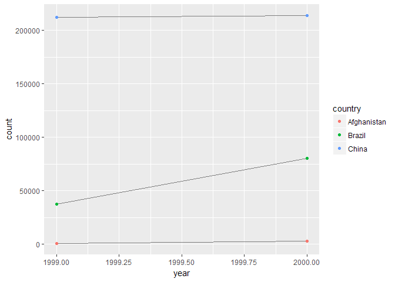

# Wrangle
Julian During  
24 Februar 2017  


```r
library(tidyverse)
library(stringr)
```


# Tidy Data

## Using prose, describe how the variables and observations are organised in each of the sample tables.

* `table1`
Every observations is a row and every variable is a column.

* `table2`
The variable `type` determines which variable we are currently looking at.

* `table3`
`rate` is the only variable in this one. It is already calculated, so it's hard 
to figure out the meaning.

* `table4a`
The years are presented as columns in this one. The numbers represent the cases

* `table4b`
The years are presented as columns in this one. The numbers represent the cases

## Compute the rate for table2, and table4a + table4b. Which representation is easiest to work with? Which is hardest? Why?

How it should look like


```r
table1 %>% 
  mutate(rate = cases / population * 10000)
```

```
## # A tibble: 6 × 5
##       country  year  cases population     rate
##         <chr> <int>  <int>      <int>    <dbl>
## 1 Afghanistan  1999    745   19987071 0.372741
## 2 Afghanistan  2000   2666   20595360 1.294466
## 3      Brazil  1999  37737  172006362 2.193930
## 4      Brazil  2000  80488  174504898 4.612363
## 5       China  1999 212258 1272915272 1.667495
## 6       China  2000 213766 1280428583 1.669488
```

For table2


```r
table2 %>% 
  group_by(country, year) %>% 
  summarise(rate = count[type == "cases"] / count[type == "population"] * 10000)
```

```
## Source: local data frame [6 x 3]
## Groups: country [?]
## 
##       country  year     rate
##         <chr> <int>    <dbl>
## 1 Afghanistan  1999 0.372741
## 2 Afghanistan  2000 1.294466
## 3      Brazil  1999 2.193930
## 4      Brazil  2000 4.612363
## 5       China  1999 1.667495
## 6       China  2000 1.669488
```

For table 3: 


```r
table3 %>% 
  mutate(
    strings = str_split(rate, "/"), 
    cases = map_int(strings, ~ as.integer(.[1])), 
    population = map_int(strings, ~ as.integer(.[2]))) %>% 
  group_by(country, year) %>% 
  summarise(rate = cases / population * 10000)
```

```
## Source: local data frame [6 x 3]
## Groups: country [?]
## 
##       country  year     rate
##         <chr> <int>    <dbl>
## 1 Afghanistan  1999 0.372741
## 2 Afghanistan  2000 1.294466
## 3      Brazil  1999 2.193930
## 4      Brazil  2000 4.612363
## 5       China  1999 1.667495
## 6       China  2000 1.669488
```

For table 4a + 4b: 


```r
table4a_tidy <- table4a %>% 
  gather(key = year, value = cases, -country)

table4b_tidy <- table4b %>% 
  gather(key = year, value = population, -country)

table4a_tidy %>% 
  left_join(table4b_tidy) %>% 
  group_by(country, year) %>% 
  summarise(rate = cases / population * 10000)
```

```
## Joining, by = c("country", "year")
```

```
## Source: local data frame [6 x 3]
## Groups: country [?]
## 
##       country  year     rate
##         <chr> <chr>    <dbl>
## 1 Afghanistan  1999 0.372741
## 2 Afghanistan  2000 1.294466
## 3      Brazil  1999 2.193930
## 4      Brazil  2000 4.612363
## 5       China  1999 1.667495
## 6       China  2000 1.669488
```

## Recreate the plot showing change in cases over time using table2 instead of table1. What do you need to do first?


```r
table2 %>% 
  filter(type == "cases") %>% 
  ggplot(aes(year, count)) + 
    geom_line(aes(group = country), colour = "grey50") + 
    geom_point(aes(colour = country))
```

<!-- -->

First you have to include a filter, to show only `type == "cases"`
